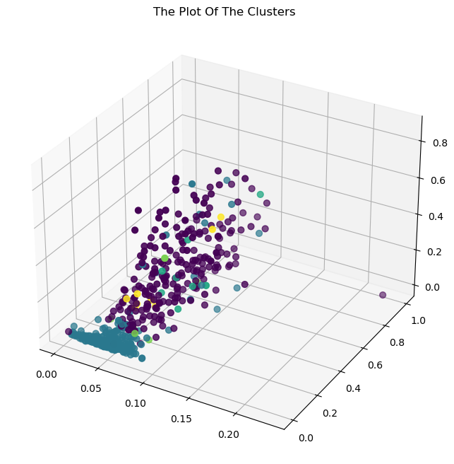

# machine-learning<h1 style="text-align: center;"> 
 Density-based clustring
</h1>

دانشکده علوم کامپیوتر دانشگاه شهید بهشتی 
### درس :  
یادگیری ماشین </br></br> 
### نام استاد :  
دکتر سید علی کتانفروش </br></br> 
### نام دانشجو : 
کیوان خوجم لی </br></br></br> 
زمستان 1401


# بیان ساده از موضوع انتخابی

#### clustring(خوشه بندی):
ابتدا مفهوم خوشه بندی را بیان میکنیم در یادگیری ماشین ما نوعی از داده ها را داریم که دارای یک دسته مشخص نیستند در واقع برچسب گذاری نشده اند ما این داده ها را با روش خوشه بندی به دسته هایی با ویژگی بسیار شبیه به هم دارند تقسیم میکنیم که به هر دسته از آنها خوشه گفته میشود. 

#### density - based clustring (خوشه بندی بر اساس چگالی):
یکی از روش های خوشه بندی استفاده از چگالی داده هاست جایی که داده در آن تراکم بیشتر دارند را یک خوشه در نظر میگیریم.

# روش پایه ایی 

### DBSCAN(Density-Based Spatial Clustering of Applications with Noise):
یک روش که در سال 1996 توسط مارتین اِستر، هانس-پتر کریگل، یورگ ساندر و شیائووی شو اعلام شد .برای مشاهده مقاله اراعه شده [اینجا](https://www.aaai.org/Papers/KDD/1996/KDD96-037.pdf?source=post_page) را کلیک کنید. 
از دلایل مفید بودن این روش میتوان به خاطر اینکه نیاز نیست تعداد دسته هارو از قبل اعلام کنیم و با روند کار به صورت طبیعی آن را کشف میکند و میتواند دسته بندی به شکل های مختلف انجام دهد نسیت به نویز حساس نیست در پایگاه داده های بزرگ کارایی نسبتا خوبی دارد

###  توضیح الگوریتم  DBSCAN 

برای درک این الگوریتم ابتدا فرض کنید چندین نقطه در فضا داریم این نقاط داده های ما هستند که هیچگونه دسته بندیی ندارند
____
حالا باید با مفاهیم زیر آشنا بشویم: 

1. ε (epsilon) : اپسیلون پارامتری است که با آن شعاع همسایگی هر نقطه مشخص میشود.</br>
که تعریف این همسایگی به فاصله اپسیلون به شرح زیر است </br>
{ $y ∈ D ; d(x,y) \le ε$}= $N_{ε}(x)$
</br>d : تابع فاصله است </br>
D : مجموعه نقاط یا داده ها
2. MinPts : حداقل تعداد یک نقطه که بتواند یک خوشه را تشکیل دهند</br>
3. Core Point :اگر حداقل MinPts داده در فاصله اپسیلون از مرکز یک داده وجود داشته باشد را به آن داده ،نقطه مرکزی میگویند.    
4. Border Point : به داده هایی که در محدوده نقطه مرکزی هستند ولی خودشان نمیتوانند نقطه مرکزی باشند را نقطه مرزی میگویند.
5. Noise : به داده هایی که نه نقطه مرکزی هستند نه در محدوده نقاط مرکزی قرار دادند را نویز میگویند.
6. Directly Density Reachable : اگرنقطه مرکزی درنظر بگیریم و در محدوده آن نقطه دومی در نظر بگیریم که خود نیز نقطه مرکزی باشد و در محدوده نقطه مرکزی اول باشد این دو نقطه مستقیم با چگالی به یکدیگر دسترسی دارند</br>
دو نقطه را قابل دسترسی مستقیم میگوییم هرگاه </br>
x,y : نقاط</br>
$ x ∈ N_{ε}(y) $ </br></br>
$|N_{ε}(y)| \ge MinPts$ </br></br>
7. Density Reachable : یک نقطه داده شده از نقطه دیگر قابل دسترسی است اگر زنجیره ایی از نقاط وجود داشته باشد که مستقیما چگالی قابل دسترسی از یکدیگر هستند آنها را به هم متصل میکند.</br>
مسیر x به y به شکل زیر تعریف میشود :</br>
$x=x_{1}, x_{2}, \dots, x_{n}=y$</br>
8. Density Connected: اگر نقطه سومی وجود داشته باشد که هر دو با چگالی قابل دسترسی باشند، یک نقطه داده شده با چگالی از یک نقطه دیگر متصل می شود - به این نقاط   اجزای متصل گفته می شود.

#### روند اجرای الگوریتم:
اجرای الگوریتم با یک نقطه دلخواه شروع می شود که بازدید نشده است. شعاع همسایگی این نقطه بررسی میشود. واگر به اندازه کافی نقطه در محدوده این نقطه دلخواه بود آن را یک خوشه نام گذاری میکنیم .و آن را نقطه مرکزی مینامیم اگر نقطه ایی در این  محدوده قبلا در دسته ایی قرار داشته باشد تمام نقاط دیگر نیز در همان دسته قرار میگیرند اگر نقطه ایی داشته باشیم که قبل تر نتوانست در محدوده خود خوشه ایی را تشکیل دهد به عنوان نویز شناخته شده باشد اگر  در محدوده این همسایگی نقطه دلخواهمان قرار گرفت حالت نقطه مرزی به خود میگیرد و برچسب نویز آن برداشته میشود.حال اینگونه تمام نقاط داخل محدوده را بررسی میکنیم وبررسی  میکنیم که میتواند آن نقطه نقطه مرکزیی بشود وسپس در محدوده نقاط مرکزی جدید نیزدنبال گسترش خوشه ادامه میدهیم تا وقتی که دیگر نفطه ایی نباشد که در این خوشه قرار گیرد آن وفت نفطه دلخواه دیگری که بازدید نششده است را پیدا کرده والگوریتم را دوباره شروع میکنیم تا تمام نقاط مشاهده شوند.

# روشن نوین

### DenMune

بسیاری از الگوریتم های خوشه بندی ممکن است به خاطر نزدیک بودن داده ها به یکدیگر یا نامتعادل بودن شکست بخورند برای همین الگوریتم denmune که فقط مبتنی بر یک هایپرپارامتر k است که نشان دهنده تعداد همسایه های نزیک یک داده است درست شده است.البته در نظر بگیرید که این الگوریتم روی دو بعد میتواند کار کند پس داده های که بیشتر از 2 ویژگی دارند باید ابعادشان کاهش پیدا کند. برای مطالعه بیشتر مقاله در [اینجا](https://www.sciencedirect.com/science/article/abs/pii/S0031320320303927) را کلیک کنید.

حال به بررسی مفاهیم اساسی الگوریتم ومکانیزم های زیر بنایی آن را شرح میدهیم:
- K-Mutual-Neighbors consistency : مفهومی قوی تر از KNN  است و باید برای هر داده در یک خوشه  MNN  آن نیز در همان خوشه باشد. </br> </br>
- Refer-To-List, reference-list and reference point: فرض میکنیم p نقطه ایی دلخواه باشد k تا همسایه داشته باشد و آنها را با $p_{i}$ نشان میدهیم که i بین 1 تا k است و فرض میکنیم این نقاط به صورت صعودی، با توجه به فاصله آنها از یک نقطه مرجع معین مرتب می شوند.به این مجموعه $KNN_{p_{i}}→$ میگویند. </br>
اگر ${p_{i}}$ عضوی از $KNN_{p_{j}}→$ باشد آنگاه ${p_{i}}$ اشاره میشود به وسیله ${p_{j}}$ 
در نتیجه ${p_{j}}$  عضوی از $KNN_{p_{i}}←$  حال اگر از این دو مجموعه اشتراک بگیریم میشود $MNN_{p_{i}}$ که میشود نزدیک ترین همسایگان متقابل ${p_{i}}$ که به آن نقطه مرجع نیز گفته میشود.</br></br>
- DenMune classification of data points into strong, weak and noise points: باتوجه به نسبت نامنفی $ r=\frac{|KNN_{p←}|}{|KNN_{p→}|}=\frac{|KNN_{p←}|}{k}$ داریم که  هر نقطه مانند p دارای 3 نوع مختلف قوی ضعیف و نویز است اگر rبزرگتر مساوی 1 باشد آنگاه نقطه قوی اگر کوچکتر از یک باشد آنگاه نقطه ضعیف و یا اگر صفر باشد یا خیلی نزدیک به صفر باشد آنرا نویز در نظر میگیریم . </br> </br> 

مرور کلی الگوریتم پیشنهادی:
نقاطی که توسط حداقل k نقطه دیگر همسایه انتخاب شود را به عنوان نقاط seed  انتخاب میشود و ستون فقرات الگوریتم در فاز یک شناخته میشود نقاطی که همسایه نقاط دیگر نمیشوند به عنوان نویز نوع 1 حذف میشوند . در فاز دوم الگوریتم نقاطی که کمتر از k نقطه  دیگر آن را مورد همسایه قرار داده یا با ادغام به خوشه ها قبلی یا درصورت نتوانستن به عنوان نویز نوع 2 حذف میشوند.در فاز اول بسیار سریع است ولی در فاز دوم آهسته است و این بزرگترین معضل این الگوریتم است.

#### روند اجرای الگوریتم :
ابتدا فاصله داده ها از یکدیگر حساب میکنیم  سپس knn  نقاط که کمترین فاصله را دارند را پیدا میکنیم سپس $MNN_{p_{i}}$  هر نقطه را به دست می آوریم با توجه به تعاریف بالا
حال به راحتی نقاط قوی و ضعیف ونویز با جساب کردن r  به دست میآید حال وارد فاز دوم الگوریتم میشویم جایی که خوشه بندی داده ها آغاز میشود ابتدا تمام داده هارا با MNN اشان اجتماع میدهیم حال اگر  n نقطه قوی داشتیم شاهد n مجموعه خواهیم بود حال شروع میکنیم تمام مجموعه هایی که باهم اشتراک دارند را باهم  ادغام میکنیم ( مثلا مجموعه A , B  اشتراکی ندارند ولی جفتشان با C اشتراک دارند پس هر سه مجموعه ادعام میشوند ) انقدر این ادغام ادامه پیدا میکند تا هیچ دو مجموعه ایی اشتراک نداشته باشند حال m مجموعه باقی میماند پس الگوریتم ما  m خوشه دارد حال در مرحله بعدی سعی میکنیم نقاط ضعیف را به خوشه ها اضافه میکنیم روند کار این است که هر نقطه ضعیف را مجموعه MNN خودش اجتماع میگیریم وسپس با تمام m خوشه اشتراک میگیریم اگر با یک خوشه اشتراک داشته باشد آن نقطه را به آن خوشه اضافه میکنیم بدیهی است که در صورت وجود اشتراک فقط با یک مجموعه اشتراک دارد در صورت اشتراک آن نقطه ضعیف را به  آن خوشه اضافه میکنیم و اگر با هیچ خوشه ایی اشتراک نداشت آنوقت به عنوان نویز نوع دو شناخته شده و الگوریتم به پایان میرسد. 

# Data

### Customer Personality Analysis

در دنیای امروز تحلیل رفتار و درک مشتری تو دنیای تجارت مهم ترین رکن تجارت است تا بتوان محصولات متناسب مشتری ها تولید کرد یا حتی در بحث تبلیغات به صورت هدفمند مواردی را تبلیغ کنیم که به کار مشتری ها بیاید و با علم دسته بندی میتوانیم مشتری هارو به دسته هایی مجزا تقسیم کرد و به راحتی بررسی کرد که هر گروه از مشتری ها به چه چیز هایی علاقه دارند و چه چیزهایی مناسب آنها هست.با این کار احتمال زیاد جلوی هزینه های زیادی رو میگیریم و احتمال موفقیت را بالا میبریم.

حوزه کاربرد این دیتا با توجه به پاراگراف بالا مشخصا در بخش  BI (Business Intelligence) که همان هوش تجاری میشود مربوط میشود.
 این حوزه مجموع فرآیند هاییست که داده های خام را به اطلاعات معنادار برای سود دهی تجاری تبدیل میکند.
 برای مشاهده بیشتر درمورد دیتای انتخابی به این [آدرس](https://www.kaggle.com/datasets/imakash3011/customer-personality-analysis) بروید.

برای خواندن داده pandas را اجرا میکنیم . سپس ابعاد داده را به دست می آوریم.
numpy برای بعضی عملیات ریاضی روی داده ها به اجرا در می آوریم.


```python
import pandas as pd
import numpy as np
df = pd.read_csv(r'marketing_campaign.csv')
df.shape
```


    (2240, 29)


```python
df.columns
```


    Index(['ID', 'Year_Birth', 'Education', 'Marital_Status', 'Income', 'Kidhome',
           'Teenhome', 'Dt_Customer', 'Recency', 'MntWines', 'MntFruits',
           'MntMeatProducts', 'MntFishProducts', 'MntSweetProducts',
           'MntGoldProds', 'NumDealsPurchases', 'NumWebPurchases',
           'NumCatalogPurchases', 'NumStorePurchases', 'NumWebVisitsMonth',
           'AcceptedCmp3', 'AcceptedCmp4', 'AcceptedCmp5', 'AcceptedCmp1',
           'AcceptedCmp2', 'Complain', 'Z_CostContact', 'Z_Revenue', 'Response'],
          dtype='object')


خب متوجه شدیم که داده ما دارای 29 ستون هست به علت زیاد بودن تعداد ستونها بخش محدودی والبته عددی را انتخاب میکنیم.
بعضی از این داده هارا مرتب میکنیم تا قابل استفاده باشند. 


```python
df.info()
```

    <class 'pandas.core.frame.DataFrame'>
    RangeIndex: 2240 entries, 0 to 2239
    Data columns (total 29 columns):
     #   Column               Non-Null Count  Dtype 
    ---  ------               --------------  ----- 
     0   ID                   2240 non-null   int64 
     1   Year_Birth           2240 non-null   int64 
     2   Education            2240 non-null   object
     3   Marital_Status       2240 non-null   object
     4   Income               2240 non-null   object
     5   Kidhome              2240 non-null   int64 
     6   Teenhome             2240 non-null   int64 
     7   Dt_Customer          2240 non-null   object
     8   Recency              2240 non-null   int64 
     9   MntWines             2240 non-null   int64 
     10  MntFruits            2240 non-null   int64 
     11  MntMeatProducts      2240 non-null   int64 
     12  MntFishProducts      2240 non-null   int64 
     13  MntSweetProducts     2240 non-null   int64 
     14  MntGoldProds         2240 non-null   int64 
     15  NumDealsPurchases    2240 non-null   int64 
     16  NumWebPurchases      2240 non-null   int64 
     17  NumCatalogPurchases  2240 non-null   int64 
     18  NumStorePurchases    2240 non-null   int64 
     19  NumWebVisitsMonth    2240 non-null   int64 
     20  AcceptedCmp3         2240 non-null   int64 
     21  AcceptedCmp4         2240 non-null   int64 
     22  AcceptedCmp5         2240 non-null   int64 
     23  AcceptedCmp1         2240 non-null   int64 
     24  AcceptedCmp2         2240 non-null   int64 
     25  Complain             2240 non-null   int64 
     26  Z_CostContact        2240 non-null   int64 
     27  Z_Revenue            2240 non-null   int64 
     28  Response             2240 non-null   int64 
    dtypes: int64(25), object(4)
    memory usage: 507.6+ KB
    


```python
df.describe()
```


<div>
<style scoped>
    .dataframe tbody tr th:only-of-type {
        vertical-align: middle;
    }

    .dataframe tbody tr th {
        vertical-align: top;
    }

    .dataframe thead th {
        text-align: right;
    }
</style>
<table border="1" class="dataframe">
  <thead>
    <tr style="text-align: right;">
      <th></th>
      <th>ID</th>
      <th>Year_Birth</th>
      <th>Kidhome</th>
      <th>Teenhome</th>
      <th>Recency</th>
      <th>MntWines</th>
      <th>MntFruits</th>
      <th>MntMeatProducts</th>
      <th>MntFishProducts</th>
      <th>MntSweetProducts</th>
      <th>...</th>
      <th>NumWebVisitsMonth</th>
      <th>AcceptedCmp3</th>
      <th>AcceptedCmp4</th>
      <th>AcceptedCmp5</th>
      <th>AcceptedCmp1</th>
      <th>AcceptedCmp2</th>
      <th>Complain</th>
      <th>Z_CostContact</th>
      <th>Z_Revenue</th>
      <th>Response</th>
    </tr>
  </thead>
  <tbody>
    <tr>
      <th>count</th>
      <td>2240.000000</td>
      <td>2240.000000</td>
      <td>2240.000000</td>
      <td>2240.000000</td>
      <td>2240.000000</td>
      <td>2240.000000</td>
      <td>2240.000000</td>
      <td>2240.000000</td>
      <td>2240.000000</td>
      <td>2240.000000</td>
      <td>...</td>
      <td>2240.000000</td>
      <td>2240.000000</td>
      <td>2240.000000</td>
      <td>2240.000000</td>
      <td>2240.000000</td>
      <td>2240.000000</td>
      <td>2240.000000</td>
      <td>2240.0</td>
      <td>2240.0</td>
      <td>2240.000000</td>
    </tr>
    <tr>
      <th>mean</th>
      <td>5592.159821</td>
      <td>1968.805804</td>
      <td>0.444196</td>
      <td>0.506250</td>
      <td>49.109375</td>
      <td>303.935714</td>
      <td>26.302232</td>
      <td>166.950000</td>
      <td>37.525446</td>
      <td>27.062946</td>
      <td>...</td>
      <td>5.316518</td>
      <td>0.072768</td>
      <td>0.074554</td>
      <td>0.072768</td>
      <td>0.064286</td>
      <td>0.013393</td>
      <td>0.009375</td>
      <td>3.0</td>
      <td>11.0</td>
      <td>0.149107</td>
    </tr>
    <tr>
      <th>std</th>
      <td>3246.662198</td>
      <td>11.984069</td>
      <td>0.538398</td>
      <td>0.544538</td>
      <td>28.962453</td>
      <td>336.597393</td>
      <td>39.773434</td>
      <td>225.715373</td>
      <td>54.628979</td>
      <td>41.280498</td>
      <td>...</td>
      <td>2.426645</td>
      <td>0.259813</td>
      <td>0.262728</td>
      <td>0.259813</td>
      <td>0.245316</td>
      <td>0.114976</td>
      <td>0.096391</td>
      <td>0.0</td>
      <td>0.0</td>
      <td>0.356274</td>
    </tr>
    <tr>
      <th>min</th>
      <td>0.000000</td>
      <td>1893.000000</td>
      <td>0.000000</td>
      <td>0.000000</td>
      <td>0.000000</td>
      <td>0.000000</td>
      <td>0.000000</td>
      <td>0.000000</td>
      <td>0.000000</td>
      <td>0.000000</td>
      <td>...</td>
      <td>0.000000</td>
      <td>0.000000</td>
      <td>0.000000</td>
      <td>0.000000</td>
      <td>0.000000</td>
      <td>0.000000</td>
      <td>0.000000</td>
      <td>3.0</td>
      <td>11.0</td>
      <td>0.000000</td>
    </tr>
    <tr>
      <th>25%</th>
      <td>2828.250000</td>
      <td>1959.000000</td>
      <td>0.000000</td>
      <td>0.000000</td>
      <td>24.000000</td>
      <td>23.750000</td>
      <td>1.000000</td>
      <td>16.000000</td>
      <td>3.000000</td>
      <td>1.000000</td>
      <td>...</td>
      <td>3.000000</td>
      <td>0.000000</td>
      <td>0.000000</td>
      <td>0.000000</td>
      <td>0.000000</td>
      <td>0.000000</td>
      <td>0.000000</td>
      <td>3.0</td>
      <td>11.0</td>
      <td>0.000000</td>
    </tr>
    <tr>
      <th>50%</th>
      <td>5458.500000</td>
      <td>1970.000000</td>
      <td>0.000000</td>
      <td>0.000000</td>
      <td>49.000000</td>
      <td>173.500000</td>
      <td>8.000000</td>
      <td>67.000000</td>
      <td>12.000000</td>
      <td>8.000000</td>
      <td>...</td>
      <td>6.000000</td>
      <td>0.000000</td>
      <td>0.000000</td>
      <td>0.000000</td>
      <td>0.000000</td>
      <td>0.000000</td>
      <td>0.000000</td>
      <td>3.0</td>
      <td>11.0</td>
      <td>0.000000</td>
    </tr>
    <tr>
      <th>75%</th>
      <td>8427.750000</td>
      <td>1977.000000</td>
      <td>1.000000</td>
      <td>1.000000</td>
      <td>74.000000</td>
      <td>504.250000</td>
      <td>33.000000</td>
      <td>232.000000</td>
      <td>50.000000</td>
      <td>33.000000</td>
      <td>...</td>
      <td>7.000000</td>
      <td>0.000000</td>
      <td>0.000000</td>
      <td>0.000000</td>
      <td>0.000000</td>
      <td>0.000000</td>
      <td>0.000000</td>
      <td>3.0</td>
      <td>11.0</td>
      <td>0.000000</td>
    </tr>
    <tr>
      <th>max</th>
      <td>11191.000000</td>
      <td>1996.000000</td>
      <td>2.000000</td>
      <td>2.000000</td>
      <td>99.000000</td>
      <td>1493.000000</td>
      <td>199.000000</td>
      <td>1725.000000</td>
      <td>259.000000</td>
      <td>263.000000</td>
      <td>...</td>
      <td>20.000000</td>
      <td>1.000000</td>
      <td>1.000000</td>
      <td>1.000000</td>
      <td>1.000000</td>
      <td>1.000000</td>
      <td>1.000000</td>
      <td>3.0</td>
      <td>11.0</td>
      <td>1.000000</td>
    </tr>
  </tbody>
</table>
<p>8 rows × 25 columns</p>
</div>


ردیف داده های NaN را حذف میکنیم  تعداد داده ها کم است!


```python
df.replace("?" , np.nan ,inplace= True)
```


```python
df.dropna(axis=0,inplace = True)
```


```python
df.isnull().sum()
```


    ID                     0
    Year_Birth             0
    Education              0
    Marital_Status         0
    Income                 0
    Kidhome                0
    Teenhome               0
    Dt_Customer            0
    Recency                0
    MntWines               0
    MntFruits              0
    MntMeatProducts        0
    MntFishProducts        0
    MntSweetProducts       0
    MntGoldProds           0
    NumDealsPurchases      0
    NumWebPurchases        0
    NumCatalogPurchases    0
    NumStorePurchases      0
    NumWebVisitsMonth      0
    AcceptedCmp3           0
    AcceptedCmp4           0
    AcceptedCmp5           0
    AcceptedCmp1           0
    AcceptedCmp2           0
    Complain               0
    Z_CostContact          0
    Z_Revenue              0
    Response               0
    dtype: int64


```python
df.Marital_Status.value_counts()
```


    Married     857
    Together    573
    Single      471
    Divorced    232
    Widow        76
    Alone         3
    Absurd        2
    YOLO          2
    Name: Marital_Status, dtype: int64


در اینجا برای پیدا کردن جمعیت خانواده های خریدار آنها را تبدیل به داده های عددی کردیم.


```python
df.replace("Married",2,inplace = True)
df.replace("Together",2,inplace = True)
df.replace("Single",1,inplace = True)
df.replace("Divorced",1,inplace = True)
df.replace("Absurd",1,inplace = True)
df.replace("Alone",1,inplace = True)
df.replace("YOLO",1,inplace = True)
df.replace("Widow",1,inplace = True)
```

حال تعداد اعضای خانواده در یک ردیف ذخیره میکنیم بقیه داده ها مربوط به تعداد فرندان و..را استفاده نمیکنیم.


```python
df["nfamilymembers"]=df['Marital_Status']+df['Kidhome']+df['Teenhome']
```

خب در اینجا هزینه گوشت و ماهی و میوه که مشتری دو سال اخیر استفاده کرده را در یک جدول به عنوان اقلام مصرفی مورد نیاز ذخیره میکنیم.
MntNecessaryProduct


```python
df["MntNecessaryProduct"]=df['MntMeatProducts']+df['MntFishProducts']+df['MntFruits']
```

اقلام مصرفی که ضروری نیستند ماند شیرینی و شراب و طلا را که مشتری طی دو سال اخیر مصرف کرده را را نیز ذخیره میکنیم.
MntExtraProducts


```python
df["MntExtraProducts"]=df['MntGoldProds']+df['MntSweetProducts']+df['MntWines']
```

تعدا دفعه ایی که مشتری ها در کمپین های شرکت خرید کردند را در NumAcceptedCmps ذخیره میکنیم.


```python
df["NumAcceptedCmps"]=df['AcceptedCmp3']+df['AcceptedCmp4']+df['AcceptedCmp5']+df['AcceptedCmp1']+df['AcceptedCmp2']
```

سن مشتری ها را در ستون age مشخص میکنیم.


```python
df['Age']=2023-df['Year_Birth']
```

حال ستون های زیر را نگه میداریم وبررسی میکنیم بقیه ستون ها را کنار میگذاریم.
 - Age :سن مشتری ها
 - Income : درآمد سالیانه مشتری ها
 - nfamilymembers : تعداد اعضای خانواده
 - MntNecessaryProduct : میزان خرید لوازم ضروری
 - MntExtraProducts : میزان خرید لوازم غیر ضروری
 - NumAcceptedCmps : میزان شرکت در کمپین های شرکت
 - Recency : تعداد روزهای پس از آخرین خرید مشتری
 - NumWebPurchases : تعداد خریدهای انجام شده از طریق وب سایت شرکت
 - NumStorePurchases : تعداد خریدهایی که مستقیماً در فروشگاه ها انجام شده است


```python
df.head()
```


<div>
<style scoped>
    .dataframe tbody tr th:only-of-type {
        vertical-align: middle;
    }

    .dataframe tbody tr th {
        vertical-align: top;
    }

    .dataframe thead th {
        text-align: right;
    }
</style>
<table border="1" class="dataframe">
  <thead>
    <tr style="text-align: right;">
      <th></th>
      <th>ID</th>
      <th>Year_Birth</th>
      <th>Education</th>
      <th>Marital_Status</th>
      <th>Income</th>
      <th>Kidhome</th>
      <th>Teenhome</th>
      <th>Dt_Customer</th>
      <th>Recency</th>
      <th>MntWines</th>
      <th>...</th>
      <th>AcceptedCmp2</th>
      <th>Complain</th>
      <th>Z_CostContact</th>
      <th>Z_Revenue</th>
      <th>Response</th>
      <th>nfamilymembers</th>
      <th>MntNecessaryProduct</th>
      <th>MntExtraProducts</th>
      <th>NumAcceptedCmps</th>
      <th>Age</th>
    </tr>
  </thead>
  <tbody>
    <tr>
      <th>0</th>
      <td>5524</td>
      <td>1957</td>
      <td>Graduation</td>
      <td>1</td>
      <td>58138</td>
      <td>0</td>
      <td>0</td>
      <td>4/9/2012</td>
      <td>58</td>
      <td>635</td>
      <td>...</td>
      <td>0</td>
      <td>0</td>
      <td>3</td>
      <td>11</td>
      <td>1</td>
      <td>1</td>
      <td>806</td>
      <td>811</td>
      <td>0</td>
      <td>66</td>
    </tr>
    <tr>
      <th>1</th>
      <td>2174</td>
      <td>1954</td>
      <td>Graduation</td>
      <td>1</td>
      <td>46344</td>
      <td>1</td>
      <td>1</td>
      <td>8/3/2014</td>
      <td>38</td>
      <td>11</td>
      <td>...</td>
      <td>0</td>
      <td>0</td>
      <td>3</td>
      <td>11</td>
      <td>0</td>
      <td>3</td>
      <td>9</td>
      <td>18</td>
      <td>0</td>
      <td>69</td>
    </tr>
    <tr>
      <th>2</th>
      <td>4141</td>
      <td>1965</td>
      <td>Graduation</td>
      <td>2</td>
      <td>71613</td>
      <td>0</td>
      <td>0</td>
      <td>21-08-2013</td>
      <td>26</td>
      <td>426</td>
      <td>...</td>
      <td>0</td>
      <td>0</td>
      <td>3</td>
      <td>11</td>
      <td>0</td>
      <td>2</td>
      <td>287</td>
      <td>489</td>
      <td>0</td>
      <td>58</td>
    </tr>
    <tr>
      <th>3</th>
      <td>6182</td>
      <td>1984</td>
      <td>Graduation</td>
      <td>2</td>
      <td>26646</td>
      <td>1</td>
      <td>0</td>
      <td>10/2/2014</td>
      <td>26</td>
      <td>11</td>
      <td>...</td>
      <td>0</td>
      <td>0</td>
      <td>3</td>
      <td>11</td>
      <td>0</td>
      <td>3</td>
      <td>34</td>
      <td>19</td>
      <td>0</td>
      <td>39</td>
    </tr>
    <tr>
      <th>4</th>
      <td>5324</td>
      <td>1981</td>
      <td>PhD</td>
      <td>2</td>
      <td>58293</td>
      <td>1</td>
      <td>0</td>
      <td>19-01-2014</td>
      <td>94</td>
      <td>173</td>
      <td>...</td>
      <td>0</td>
      <td>0</td>
      <td>3</td>
      <td>11</td>
      <td>0</td>
      <td>3</td>
      <td>207</td>
      <td>215</td>
      <td>0</td>
      <td>42</td>
    </tr>
  </tbody>
</table>
<p>5 rows × 34 columns</p>
</div>


```python
data = [df['Age'],df['Income'],df['nfamilymembers'],df['MntNecessaryProduct']
        ,df['MntExtraProducts'],df['NumAcceptedCmps'],df['Recency'],df['NumWebPurchases'],df['NumStorePurchases']]
dataAray= np.array(data)
finalDf = pd.DataFrame(dataAray.T)
finalDf=finalDf.rename(columns={0:'Age',1:'Income',2:'nfamilymembers',3:'MntNecessaryProduct',
                      4:'MntExtraProducts',5:'NumAcceptedCmps',6:'Recency',7:'NumWebPurchases',8:'NumStorePurchases'})


print(finalDf.head())
print(finalDf.shape)

```

      Age Income nfamilymembers MntNecessaryProduct MntExtraProducts  \
    0  66  58138              1                 806              811   
    1  69  46344              3                   9               18   
    2  58  71613              2                 287              489   
    3  39  26646              3                  34               19   
    4  42  58293              3                 207              215   
    
      NumAcceptedCmps Recency NumWebPurchases NumStorePurchases  
    0               0      58               8                 4  
    1               0      38               1                 2  
    2               0      26               8                10  
    3               0      26               2                 4  
    4               0      94               5                 6  
    (2216, 9)
    

داده ها را محدود به نقاط 0 تا یک میکنیم تا بررسی کردنشون راحت تر باشه


```python
from sklearn.preprocessing import  minmax_scale

scale_data = minmax_scale(finalDf , feature_range=(0,1))
finalDf=pd.DataFrame(scale_data , 
                  index=finalDf.index , 
                  columns = finalDf.columns)
finalDf.head()
```


<div>
<style scoped>
    .dataframe tbody tr th:only-of-type {
        vertical-align: middle;
    }

    .dataframe tbody tr th {
        vertical-align: top;
    }

    .dataframe thead th {
        text-align: right;
    }
</style>
<table border="1" class="dataframe">
  <thead>
    <tr style="text-align: right;">
      <th></th>
      <th>Age</th>
      <th>Income</th>
      <th>nfamilymembers</th>
      <th>MntNecessaryProduct</th>
      <th>MntExtraProducts</th>
      <th>NumAcceptedCmps</th>
      <th>Recency</th>
      <th>NumWebPurchases</th>
      <th>NumStorePurchases</th>
    </tr>
  </thead>
  <tbody>
    <tr>
      <th>0</th>
      <td>0.378641</td>
      <td>0.084832</td>
      <td>0.00</td>
      <td>0.466396</td>
      <td>0.479241</td>
      <td>0.0</td>
      <td>0.585859</td>
      <td>0.296296</td>
      <td>0.307692</td>
    </tr>
    <tr>
      <th>1</th>
      <td>0.407767</td>
      <td>0.067095</td>
      <td>0.50</td>
      <td>0.004635</td>
      <td>0.008897</td>
      <td>0.0</td>
      <td>0.383838</td>
      <td>0.037037</td>
      <td>0.153846</td>
    </tr>
    <tr>
      <th>2</th>
      <td>0.300971</td>
      <td>0.105097</td>
      <td>0.25</td>
      <td>0.165701</td>
      <td>0.288256</td>
      <td>0.0</td>
      <td>0.262626</td>
      <td>0.296296</td>
      <td>0.769231</td>
    </tr>
    <tr>
      <th>3</th>
      <td>0.116505</td>
      <td>0.037471</td>
      <td>0.50</td>
      <td>0.019119</td>
      <td>0.009490</td>
      <td>0.0</td>
      <td>0.262626</td>
      <td>0.074074</td>
      <td>0.307692</td>
    </tr>
    <tr>
      <th>4</th>
      <td>0.145631</td>
      <td>0.085065</td>
      <td>0.50</td>
      <td>0.119351</td>
      <td>0.125741</td>
      <td>0.0</td>
      <td>0.949495</td>
      <td>0.185185</td>
      <td>0.461538</td>
    </tr>
  </tbody>
</table>
</div>


# پیاده سازی روش پایه ایی
ابتدا کتابخانه های مورد نیاز را import میکنیم
- scipy.spatial.distance برای پیدا کردن فاصله ها
- MatPlotLib , seaborn  برای نمایش و تجسم داده ها
-  StandardScaler  برای پیش پردازش داده ها
- t-distributed Stochastic Neighbor Embedding برای کمک به تجسم سازی
- DBSCAN  برای مقایسه پیاده سازی ما با پیاده سازی اصلی


```python
from scipy.spatial import distance
import seaborn as sns
import matplotlib.pyplot as plt
from sklearn.preprocessing import StandardScaler
from sklearn.manifold import TSNE
from sklearn.cluster import DBSCAN
```

 حال در این جا تابع اصلی را تعریف میکنیم 


```python
def simple_DBSCAN(X, clusters, eps, minPts, metric=distance.euclidean):
    
    currentPoint = 0
    
    for i in range(0, X.shape[0]):
        if clusters[i] != 0:
            continue
    
        neighbors = neighborsGen(X, i, eps, metric)

        if len(neighbors) < minPts:
            clusters[i] = -1

        else:
            currentPoint += 1
            expand(X, clusters, i, neighbors, currentPoint, eps, minPts, metric)
    
    return clusters
```

 نمودار همسایگی را برای یک نقطه مشخص ایجاد می کند


```python
def neighborsGen(X, point, eps, metric):
    
    neighbors = []
    
    for i in range(X.shape[0]):
        if metric(X[point], X[i]) < eps:
            neighbors.append(i)
    
    return neighbors
```

 تابع زیر همسایه های یک داده را پیدا میکند


```python
def expand(X, clusters, point, neighbors, currentPoint, eps, minPts, metric):
    
    clusters[point] = currentPoint
    
    i = 0
    while i < len(neighbors):
        
        nextPoint = neighbors[i]
        
        if clusters[nextPoint] == -1:
            clusters[nextPoint] = currentPoint
        
        elif clusters[nextPoint] == 0:
            clusters[nextPoint] = currentPoint
            
            nextNeighbors = neighborsGen(X, nextPoint, eps, metric)
            
            if len(nextNeighbors) >= minPts:
                neighbors = neighbors + nextNeighbors
        
        i += 1
```

در اینجا ما در حال گسترش از نقطه اصلی خود هستیم، همسایه های همسایه، سپس همسایه ها، همسایه های همسایه و غیره را پیدا می کنیم تا به مرزهای محله برسیم. مرزی که در آن نقاط اصلی ما تمام می شود و نقاط مرزی جای خود را به نویز می دهند.
این فرآیند تا زمانی تکرار می شود که هر نقطه ای که به یک خوشه یا نویز اختصاص داده نشده باشد، برچسب گذاری شود. در نهایت، می توانیم همه اینها را در یک کلاس بپیچیم و شروع به آزمایش کنیم!


   ## پارامتر ها :
    
    eps: نمودار شعاع همسایگی
    
    minPts: تعداد همسایگان مورد نیاز برای برچسب گذاری یک نقطه معین به عنوان نقطه اصلی
    
    Metric: فاصله که برای تعیین فاصله بین نقاط استفاده می شود 
    در حال حاضر معیارهای scipy.spatial.distance را برای دو بردار عددی می پذیرد
    
    x: یک آرایه n بعدی از بردارهای عددی که باید تجزیه و تحلیل شوند
    
   


```python
class Basic_DBSCAN:
    
    def __init__(self, eps, minPts, metric=distance.euclidean):
        self.eps = eps
        self.minPts = minPts
        self.metric = metric
    
    def fit_predict(self, X):
        
        clusters = [0] * X.shape[0]
        
        simple_DBSCAN(X, clusters, self.eps, self.minPts, self.metric)
        
        return clusters
```

حال در اینجا از داده هایی که بالاتر توضیح دادیم استفاده میکنیم و eps را برابر   0.4  و minPts  را برابر 30 قرار میدهیم و از متریک پیش فرض استفاده میکنیم:
همچنین یک تابع ساده برای مقایسه خروجی ها نوشتیم. به علت کند بودن الگوریتم و نمایش بهتر داده ها روی نمودار ها فقط روی 500 تا از داده ها تست هارا انجام داده اییم. </br>
یک تابع ساده برای ارزیابی یکسان بودن دوتا خروجی از توابع ما و sk learn  استفاده میکنیم.


```python
cols = finalDf.columns
newDf = finalDf.head(500)

scanner = Basic_DBSCAN(eps=0.4, minPts=30)

def checkEqual(l1, l2):
    
    return len(l1) == len(l2) and sorted(l1) == sorted(l2)
newDf.shape
```


    (500, 9)


برای شروع ما از دو ویژگی  Age و Income استفاده میکنیم و امیدواریم خوشه بندی مناسبی را برای ما داشته باشد.


```python
X = newDf[[cols[0], cols[1]]]
X = StandardScaler().fit_transform(X)

clusters = scanner.fit_predict(X)

sk_clusters = DBSCAN(eps=0.4, min_samples=30, metric=distance.euclidean).fit(X).labels_
sk_clusters = [x+1
               if x != -1
               else x
               for x in sk_clusters]

print(f'Results are same as sk-learn: {checkEqual(clusters, sk_clusters)}')

# my clusters
sns.scatterplot(newDf.iloc[:, 0], newDf.iloc[:, 1], 
                hue=clusters, palette='bright')
plt.title('Plotted from my clusters!')
plt.show();

# sk-learn clusters
sns.scatterplot(newDf.iloc[:, 0], newDf.iloc[:, 1], 
                hue=sk_clusters, palette='bright')
plt.title("Plotted from sk-learn clusters!")
plt.show();

clusters=pd.DataFrame(clusters)
print(clusters.value_counts())

sk_clusters=pd.DataFrame(sk_clusters)
print(sk_clusters.value_counts())
```

    Results are same as sk-learn: True
    

    


    

    


    


    

    


     2    198
    -1    171
     3     66
     1     65
    dtype: int64
     2    198
    -1    171
     3     66
     1     65
    dtype: int64
    

داده ها به سه دسته 1 2 3 تقسیم شده است و 1- نیز نشان دهنده نویز هاست!
نتیجه میگیریم که روی داده ها الگوریتممان به درستی همانند sk-learn کار کرد.

حال سعی میکنیم در سه ویژگی بررسی کنیم داده ها را مشخصا هایپر پارامتر ها را تغییر میدهیم!
NumStorePurchases و  NumWebPurchasRecency و Recency 


```python
scanner = Basic_DBSCAN(eps=0.4, minPts=8)

X = newDf[[cols[6], cols[7],cols[8]]]
X = StandardScaler().fit_transform(X)
clusters = scanner.fit_predict(X)

fig = plt.figure(figsize=(10,8))
ax = plt.subplot(111, projection='3d')
ax.scatter(newDf.iloc[:, 1], newDf.iloc[:, 3],newDf.iloc[:, 4], s=40, c=clusters, marker='o', cmap = 'viridis' )
ax.set_title("The Plot Of The Clusters")
plt.show()
clusters=pd.DataFrame(clusters)
print(clusters.value_counts())
```


    

    


     1    240
    -1    235
     2      9
     3      8
     4      8
    dtype: int64
    

حالا برای تمام ویژگی هایی که داریم این کار را تست میکنیم . و مشخصا هایپر پارامتر های eps , minPt را کمی تغییر میدهیم. 


```python
X = StandardScaler().fit_transform(newDf)

clusters = Basic_DBSCAN(eps=1.4, minPts=7).fit_predict(X)
sk_clusters = DBSCAN(eps=1.4, min_samples=7).fit(X)

sk_clusters = sk_clusters.labels_
sk_clusters = [x+1
               if x != -1
               else x
               for x in sk_clusters]

print(f'Results are same as sk-learn: {checkEqual(clusters, sk_clusters)}')

sns.scatterplot(newDf.iloc[:, 0], newDf.iloc[:, 1], 
                hue=clusters, palette='bright')
plt.title('Plotted from my clusters!')
plt.show()
clusters=pd.DataFrame(clusters)
print(clusters.value_counts())
```

    Results are same as sk-learn: True
    


    

    


     1    253
    -1    231
     2      7
     3      5
     4      4
    dtype: int64
    

خب نتایج نشان میدهد در ابعاد بالاتر نیز توانسته است داده ها را همگام با پیاده سازی sklearn درست پیش بینی کند.</br></br></br> 

مشخصا تجسم داده 9 بعدی روی دو بعد قابل ارزیابی و قابل لمس نیست پس ما از sk-learn t-SNE استفاده میکنیم تا تجسم ملموس تری داشته باشیم.
این کتابخانه ابعاد داده را کاهش میدهد. اینجا ازخروجی دسته بند قبلی استفاده میکنیم. 
ابتدا ابعاد را به دو بعد کاهش میدهیم.


```python
tsne = TSNE(n_components=2, perplexity=50, n_jobs=-2, n_iter=5000, random_state=42)

X = StandardScaler().fit_transform(newDf)

tsne_components = tsne.fit_transform(X)

ts = pd.DataFrame(tsne_components)
ts['cluster'] = clusters
ts.columns = ['x', 'y', 'cluster']

plt.figure(figsize=(10,10))

sns.scatterplot(data=ts, x='x', y='y', 
                hue='cluster', legend='full', palette='bright')
plt.title('Plotted from my clusters!')
plt.show()

clusters=pd.DataFrame(clusters)
print(clusters.value_counts())
```

    


    

    


     1    253
    -1    231
     2      7
     3      5
     4      4
    dtype: int64
    

حال داده ها را به سه بعد میبریم و نرمالایزشون میکنیم.


```python
tsne = TSNE(n_components=3, perplexity=50, n_jobs=-2, n_iter=5000, random_state=42)

X = StandardScaler().fit_transform(newDf)

tsne_components = tsne.fit_transform(X)

ts = pd.DataFrame(tsne_components)
scale_data = minmax_scale(ts , feature_range=(0,1))
ts=pd.DataFrame(scale_data , 
                  index=ts.index , 
                  columns = ts.columns)
print(ts.head())
ts.shape

```

    C:\Users\keyvan\anaconda3\lib\site-packages\sklearn\manifold\_t_sne.py:780: FutureWarning: The default initialization in TSNE will change from 'random' to 'pca' in 1.2.
      warnings.warn(
    C:\Users\keyvan\anaconda3\lib\site-packages\sklearn\manifold\_t_sne.py:790: FutureWarning: The default learning rate in TSNE will change from 200.0 to 'auto' in 1.2.
      warnings.warn(
    

              0         1         2
    0  0.021872  0.623527  0.504375
    1  0.692645  0.673663  0.498913
    2  0.269037  0.448778  0.304906
    3  0.779132  0.266111  0.518881
    4  0.451334  0.421658  0.079385
    


    (500, 3)


### حال داده هارا با هایپر پارامتر های جدید خوشه بندی میکنیم.


```python
X = StandardScaler().fit_transform(ts)
scanner = Basic_DBSCAN(eps=0.6, minPts=15)

clusters = scanner.fit_predict(X)

fig = plt.figure(figsize=(10,10))
ax = plt.subplot(222, projection='3d')
ax.scatter(ts.iloc[:, 0], ts.iloc[:, 1],ts.iloc[:, 2], s=40, c=clusters, marker='o', cmap = 'viridis' )
ax.set_title("The Plot Of The Clusters with eps=0.6, minPts=15")
plt.show()
clusters=pd.DataFrame(clusters)
print(clusters.value_counts())
```


    

    


    -1    277
     3     62
     1     54
     2     42
     4     36
     6     16
     5     13
    dtype: int64
    


```python
scanner = Basic_DBSCAN(eps=0.6, minPts=5)

clusters = scanner.fit_predict(X)

fig = plt.figure(figsize=(10,10))
ax = plt.subplot(222, projection='3d')
ax.scatter(ts.iloc[:, 0], ts.iloc[:, 1],ts.iloc[:, 2], s=40, c=clusters, marker='o', cmap = 'viridis' )
ax.set_title("The Plot Of The Clusters with eps=0.6, minPts=5")
plt.show()
clusters=pd.DataFrame(clusters)
print(clusters.value_counts())
```


    

    


     1    491
    -1      9
    dtype: int64
    


```python
scanner = Basic_DBSCAN(eps=0.5, minPts=5)

clusters = scanner.fit_predict(X)

fig = plt.figure(figsize=(10,10))
ax = plt.subplot(222, projection='3d')
ax.scatter(ts.iloc[:, 0], ts.iloc[:, 1],ts.iloc[:, 2], s=40, c=clusters, marker='o', cmap = 'viridis' )
ax.set_title("The Plot Of The Clusters with eps=0.5, minPts=5")
plt.show()
clusters=pd.DataFrame(clusters)
print(clusters.value_counts())
```


    

    


     1    465
    -1     22
     2      5
     3      4
     4      4
    dtype: int64
    


```python
scanner = Basic_DBSCAN(eps=1, minPts=5)

clusters = scanner.fit_predict(X)

fig = plt.figure(figsize=(10,10))
ax = plt.subplot(222, projection='3d')
ax.scatter(ts.iloc[:, 0], ts.iloc[:, 1],ts.iloc[:, 2], s=40, c=clusters, marker='o', cmap = 'viridis' )
ax.set_title("The Plot Of The Clusters with eps=1, minPts=5")
plt.show()
clusters=pd.DataFrame(clusters)
print(clusters.value_counts())
```


    

    


    1    500
    dtype: int64
    

نتیجه گیری که میتوانم بکنم این است که در داده هایی که اکثر داده ها یکجا متمرکز هستند به دشواری میتواند خوشه بندی مناسبی پیدا کند و داده نویز بسیاری را کشف میکند. و باتوجه به اینکه داده بدون لیبل بود تابع ارزیابی درستی برای داده ها پیدا نکردم والبته با توجه به وجود تابع در sk learn حداقل متوجه میشویم کد به اندازه کافی خوب عمل کرده است و متوجه شدم eps  و minPts تا حدودی باید در یک راستا زیاد یا کم بشوند و البته از محدوده خاص نه بیشتر ونه کمتر بشوند تا بتواند تعادل را در  بحث خوشه بندی حفظ کند. 

----------

-----------

# پیاده سازی روش نوین

ابتدا کتاب خانه های لازم را import میکنیم


```python
from scipy.spatial import distance
import numpy as np
import pandas as pd
from matplotlib import pyplot as plt
import seaborn as sns
from sklearn.preprocessing import StandardScaler
```

کلاس اصلی تابع را در اینجا میسازیم تنها هایپر پارامتر ما knn است که با آن بتوانیم همسایه های داده هایمان را پیدا کنیم.


```python
class basic_Denmune:
    
    def __init__(self , knn , metric=distance.euclidean):
        self.knn=knn
        self.metric=metric
    
    def fit_predict(self,X):
        
        clusters = [0] * len(X)
        
        clusters = simple_Denmune(X,self.knn,self.metric) 
        
        return clusters
```

#### فاز اول
الگوریتم اصلی را در اینجا فراخوانی میکنیم و ابتدا knn همسایه را پیدا میکنیم سپس با نتیجه حاصل MNN  هر نقطه از داده را بررسی میکنیم وپیدا میکنیم
سپس محموعه نقاطی که Seed هستند شناخته میشوند در این مرحله نقاط نویز نوع 1 حذف میشوند وبقیه نقط که نقاط ضعیف هستند نیز جدا میشوند


```python
def simple_Denmune(X, knn, metric=distance.euclidean):
    
   
    neighbors = []
    
    KNN_neighbors = []
    
    for i in range(len(X)):
        
        neighbors.append((i,neighborsGen(X, i, knn, metric)))

    for i in range(len(X)):
        
        knn_n = []
        
        for j in range(len(X)):
            
            if(i != j):
                
                kernel = []
                
                kernel.append(i)
                
                if i in neighbors[j][1]:
                    
                    knn_n.append(j)
                    
        KNN_neighbors.append((i,knn_n))
    
    MNN = [] #MMN of each data point
    
    for i in range(len(X)):
        
        Mnn = list(set(KNN_neighbors[i][1]).intersection(neighbors[i][1]))
        
        MNN.append((i,Mnn))
        
        
    
    ListSetO = [] # list of noise type 1
    
    ListSetS = [] #list of strong points of data
    
    ListSetQ = [] #list of weak points of data
    
    for element in MNN:
        
        sizeofeleman = len( element[1] )
        
        if sizeofeleman >= knn :
            
            ListSetS.append(( element[0] , element[1] ))
            
        elif sizeofeleman == 0 :
            
            ListSetO.append(( element[0]  ))
            
        else:
            
            ListSetQ.append(( element[0] , element[1] ))
  

    setclusters = CreateClustersSkeleton(ListSetS , knn , X )
    
    setclusters = AssignWeakPoints(ListSetQ , knn , X , setclusters)
    
    clusters = fix_Clusters ( X , setclusters  )
    
    return clusters
```

#### فاز دوم
 اینجا شروع فاز دوم است جایی که نقاط Seed در صورت اشتراک با یک دیگر یک خوشه تشکیل میدهند و در صورت اشتراک نداشتن نیز خودشان شروع کننده یک خوشه جدید هستند.


```python
def CreateClustersSkeleton( ListSetS , knn , X ):
    
    setS = [] #list of set of strong point
    
    
    for element in ListSetS:
        
        checkpoints = []
        
        checkpoints.append(element[0])
        
        checkpoints.extend(element[1])
        
        checkpoints = set(checkpoints)
        
        setS.append(checkpoints)
        
        
    checkList = [1] * len(setS)
    
    for i in range( len(setS) ):
        
        if checkList[i] == 0 :
            
            continue
            
        for j in range( len(setS) ):
            
            if i == j:
                
                continue
            
            elif checkList[j] == 1 :
                
                checkSetEmpty = setS[i].intersection(setS[j])
                
                if len(checkSetEmpty) != 0 :
                    
                    checkList[j] = 0
                    
                    setS[i] = setS[i].union(setS[j])
                    
    LastSetS=[]
    
    for i in range( len(setS) ):
        
        if checkList[i] == 1 :
            
            LastSetS.append( setS[i] )
            
    
    return LastSetS

```

در اینجا سعی میکنیم نقاط ضعیف تر را به خوشه های ساخته شده توسط نقاط Seed  ملحق کنیم اگر نقطه ایی نتواند به این خوشه ها ملحق شود به عنوان نویز نوع دو شناخته شده و حذف میشود


```python
def AssignWeakPoints(ListSetQ , knn , X , clusters):
    
    setQ=[]
    
    for element in ListSetQ:
        
        checkpoints = []
        
        checkpoints.append(element[0])
        
        checkpoints.extend(element[1])
        
        checkpoints = set(checkpoints)
        
        setQ.append((element[0],checkpoints))
        
    
    
    for element in clusters :
        
        checkIntersection=[]
        
        for item in setQ:
            
            checkIntersection = element.intersection(item[1])
            
            if len(checkIntersection) != 0 :
                
                element.add(item[0])
                
                continue
                
    
    return clusters
            
```

در اینجا به هر خوشه یک label  میدهیم label  ها شماره هایی از یک شروع میشود و به تعداد خوشه ها این عدد افزایش پیدا میکند به نقاط نویز عدد 1- را به عنوان label  در نظر میگیریم 


```python
def fix_Clusters ( X , setclusters):
    
    clusters = [-1] * len(X)
    
    m = len(setclusters)
    
    for i in range(m):
        
        item = []
        
        item = setclusters[i]
        
        item = convert(item)
        
        for element in item:
            
            clusters[element] = i+1
        
    return clusters
    
```

در اینجا knn  همسایه هر داده را پیدا میکنیم.


```python
def neighborsGen(X, point, knn , metric):
    
    distance = []
    
    for i in range(len(X)):
        
        dist=metric(X[point], X[i])
        
        if dist == 0.0:
            
            continue
            
        distance.append((i,X[i],dist))
        
    distance.sort(key=lambda tup:tup[2])
    
    neighbors=[];
    
    for i in range(knn):
        
        neighbors.append(distance[i][0])
                         
    return neighbors
```

در اینجا یک تابع کوچک برای برای تبدیل Set به list  مینویسیم.


```python
def convert(s):
    
    return [elem for elem in s]
```

حال تابع را با knn = 25 شروع میکنیم


```python
scannerDen = basic_Denmune(25)
```

ابتدا روی  دو ستون اول فرایند خوشه بندی را اجرا میکنیم


```python
X = newDf[[cols[0], cols[1]]]
```


```python
X= np.array(X)
clusters = scannerDen.fit_predict(X)
```


```python
sns.scatterplot(newDf.iloc[:, 0], newDf.iloc[:, 1], 
                hue=clusters, palette='bright')
plt.title('Plotted from my clusters!')
plt.show();
clusters=pd.DataFrame(clusters)
print(clusters.value_counts())
```


    


    

    


     3    362
     1     68
     2     57
    -1     13
    dtype: int64
    

در اینجا متوجه میشویم این الگوریتم توانست داده های متمرکز رو خوشه بندی کنه. اگر با اولین خوشه بندی DBSCAN  مقایسه کنیم داده نویز کمتر و خوشه هایی با تعداد اعضای متناسب .
آلبته شاهد این هستیم که خوشه ها شکل متفاوت تری را به خودشون میگیرن.

----------------

حال داده ها را به دو بعد میبریم و فرایند خوشه بندی را دوباره تست کنیم.


```python
tsne = TSNE(n_components=2, perplexity=50, n_jobs=-2, n_iter=5000, random_state=42)

X = StandardScaler().fit_transform(newDf)

tsne_components = tsne.fit_transform(X)
```

    C:\Users\keyvan\anaconda3\lib\site-packages\sklearn\manifold\_t_sne.py:780: FutureWarning: The default initialization in TSNE will change from 'random' to 'pca' in 1.2.
      warnings.warn(
    C:\Users\keyvan\anaconda3\lib\site-packages\sklearn\manifold\_t_sne.py:790: FutureWarning: The default learning rate in TSNE will change from 200.0 to 'auto' in 1.2.
      warnings.warn(
    


```python
ts = pd.DataFrame(tsne_components)
scale_data = minmax_scale(ts , feature_range=(0,1))
ts=pd.DataFrame(scale_data , 
                  index=ts.index , 
                  columns = ts.columns)
```


```python
ts_Array= np.array(ts)
scannerDen = basic_Denmune(20)
clusters = scannerDen.fit_predict(ts_Array)
```


```python
ts['cluster'] = clusters
ts.columns = ['x', 'y', 'cluster']

plt.figure(figsize=(5,5))

sns.scatterplot(data=ts, x='x', y='y', 
                hue='cluster', legend='full', palette='bright')
plt.title('Plotted from my clusters!')
plt.show()


```


    

    


```python
clusters=pd.DataFrame(clusters)
print(clusters.value_counts())
```

     1    221
     4    136
     2     74
     3     65
    -1      4
    dtype: int64
    

با توجه به اینکه مقاله برای داده های دو بعدی تنظیم شده بود الگوریتم را برای داده با بعد بالاتر تنظیم کردم پس از کل ابعاد ویژگی های داده برای خوشه بندی استفاده میکنیم و نتیجه را بررسی میکنیم. در اینجا دو مقدار Age , income  را برای نمایش داده ها استفاده میکنیم.


```python
newDf_Array= np.array(newDf)
scannerDen = basic_Denmune(20)
clusters = scannerDen.fit_predict(newDf_Array)
```


```python
sns.scatterplot(newDf.iloc[:, 0], newDf.iloc[:, 1], 
                hue=clusters, palette='bright')
plt.title('Plotted from my clusters!')
plt.show();
```


    

    


دلیل نا واضح بودن:از آنجا که خوشه بندی در ابعاد بالا با دو بعد انتخابی 9 بعد نمایش قابل توجهی ندارد 
حال در اینجا  به جای دو فیچر انتخابی داده ها را روی ابعاد کاهش یافته نشان میدهیم. و احتمال میدهیم نمایش بهتری را شاهد خواهیم بود. 


```python
ts = pd.DataFrame(tsne_components)
ts['cluster'] = clusters
ts.columns = ['x', 'y', 'cluster']

plt.figure(figsize=(8,8))

sns.scatterplot(data=ts, x='x', y='y', 
                hue='cluster', legend='full', palette='bright')
plt.title('Plotted from my clusters!')
plt.show()
```


    

    


```python
clusters=pd.DataFrame(clusters)
print(clusters.value_counts())
```

     3    250
     2    118
     1     91
    -1     41
    dtype: int64
    

از آنجا که الگوریتم مورد نظر ما فقط یک هایپر پارامتر دارد آنهم knn به ازای مقادیر مختلف knn  خوشه بندی میکنیم تا تاثیر knn را شاهد باشیم


```python
scannerDen = basic_Denmune(20)
clusters = scannerDen.fit_predict(newDf_Array)
ts = pd.DataFrame(tsne_components)
ts['cluster'] = clusters
ts.columns = ['x', 'y', 'cluster']

plt.figure(figsize=(8,8))

sns.scatterplot(data=ts, x='x', y='y', 
                hue='cluster', legend='full', palette='bright')
plt.title("The Plot Of The Clusters with knn =20")
plt.show()

clusters=pd.DataFrame(clusters)
print(clusters.value_counts())
```


    

    


     3    250
     2    118
     1     91
    -1     41
    dtype: int64
    


```python
scannerDen = basic_Denmune(5)
clusters = scannerDen.fit_predict(newDf_Array)
ts = pd.DataFrame(tsne_components)
ts['cluster'] = clusters
ts.columns = ['x', 'y', 'cluster']

plt.figure(figsize=(8,8))

sns.scatterplot(data=ts, x='x', y='y', 
                hue='cluster', legend='full', palette='bright')
plt.title("The Plot Of The Clusters with knn =5")
plt.show()

clusters=pd.DataFrame(clusters)
print(clusters.value_counts())
```


    

    


    -1     147
     12    127
     7      47
     8      32
     13     28
     6      24
     9      19
     4      17
     2      16
     14     11
     10      9
     1       8
     11      7
     3       6
     5       2
    dtype: int64
    


```python
scannerDen = basic_Denmune(70)
clusters = scannerDen.fit_predict(newDf_Array)
ts = pd.DataFrame(tsne_components)
ts['cluster'] = clusters
ts.columns = ['x', 'y', 'cluster']

plt.figure(figsize=(8,8))

sns.scatterplot(data=ts, x='x', y='y', 
                hue='cluster', legend='full', palette='bright')
plt.title("The Plot Of The Clusters with knn =70")
plt.show()

clusters=pd.DataFrame(clusters)
print(clusters.value_counts())
```


    

    


     1    483
    -1     17
    dtype: int64
    

نتیجه که میتوانم بگیرم نویز کمتری را شاهد هستیم به ازای مقادی کمknn شاهد تعداد خوشه های بسیار زیاد و مقادیر knn زیاد َ شاهد یک خوشه و نویز هستیم از آنجا که خود داده ها label ندارند پس ارزیابی دقیقی برای پیدا کردن بهترین knn نداریم ولی با توجه به وضعیت نسبت به dbscan  میتواند خوشه های بیشتر را پیدا کند.

-------

------------

<h1 style="text-align: center;"> 
  labeled data with DenMune
</h1>

از آنجا که داده های انتخابی داری label نبودند در اینجا ما سعی کردیم از داده های iris برای خوشه بندی  DenMune استفاده کنیم ونتیجه آن را بررسی کنیم. </br>
درباره این داده میتوان گفت شامل سه گونه زنبق با 50 نمونه و همچنین برخی از خواص هر گل می باشد. یک گونه گل به صورت خطی از دو گونه دیگر قابل تفکیک است، اما دو گونه دیگر به صورت خطی از یکدیگر قابل جدا شدن نیستند.
برای مشاهده بیشتر درمورد دیتای انتخابی به این [آدرس](https://www.kaggle.com/datasets/himanshunakrani/iris-dataset) بروید.


```python
df_iris = pd.read_csv(r'iris.csv')
df_iris.shape
```


    (150, 5)


```python
df_iris.info()
```

    <class 'pandas.core.frame.DataFrame'>
    RangeIndex: 150 entries, 0 to 149
    Data columns (total 5 columns):
     #   Column        Non-Null Count  Dtype  
    ---  ------        --------------  -----  
     0   sepal_length  150 non-null    float64
     1   sepal_width   150 non-null    float64
     2   petal_length  150 non-null    float64
     3   petal_width   150 non-null    float64
     4   species       150 non-null    object 
    dtypes: float64(4), object(1)
    memory usage: 6.0+ KB
    


```python
df_iris.species.value_counts()
```


    setosa        50
    versicolor    50
    virginica     50
    Name: species, dtype: int64


داده ها  دارای 3 label هستند با یک بررسی ساده متوجه میشوید که 50 داده اول دارای labelبه نام setosa 50 تای بعدی versicolor  و 50 تای بعدی virginica میباشد پس :


```python
df_iris.replace("setosa",1,inplace = True)
df_iris.replace("versicolor",2,inplace = True)
df_iris.replace("virginica",3,inplace = True)
```


```python
df_iris.head()
```


<div>
<style scoped>
    .dataframe tbody tr th:only-of-type {
        vertical-align: middle;
    }

    .dataframe tbody tr th {
        vertical-align: top;
    }

    .dataframe thead th {
        text-align: right;
    }
</style>
<table border="1" class="dataframe">
  <thead>
    <tr style="text-align: right;">
      <th></th>
      <th>sepal_length</th>
      <th>sepal_width</th>
      <th>petal_length</th>
      <th>petal_width</th>
      <th>species</th>
    </tr>
  </thead>
  <tbody>
    <tr>
      <th>0</th>
      <td>5.1</td>
      <td>3.5</td>
      <td>1.4</td>
      <td>0.2</td>
      <td>1</td>
    </tr>
    <tr>
      <th>1</th>
      <td>4.9</td>
      <td>3.0</td>
      <td>1.4</td>
      <td>0.2</td>
      <td>1</td>
    </tr>
    <tr>
      <th>2</th>
      <td>4.7</td>
      <td>3.2</td>
      <td>1.3</td>
      <td>0.2</td>
      <td>1</td>
    </tr>
    <tr>
      <th>3</th>
      <td>4.6</td>
      <td>3.1</td>
      <td>1.5</td>
      <td>0.2</td>
      <td>1</td>
    </tr>
    <tr>
      <th>4</th>
      <td>5.0</td>
      <td>3.6</td>
      <td>1.4</td>
      <td>0.2</td>
      <td>1</td>
    </tr>
  </tbody>
</table>
</div>


```python
cols = df_iris.columns
Y=df_iris[[cols[4]]]
Y= np.array(Y)
X = df_iris[[cols[0], cols[1],cols[2],cols[3]]]
X.head()
```


<div>
<style scoped>
    .dataframe tbody tr th:only-of-type {
        vertical-align: middle;
    }

    .dataframe tbody tr th {
        vertical-align: top;
    }

    .dataframe thead th {
        text-align: right;
    }
</style>
<table border="1" class="dataframe">
  <thead>
    <tr style="text-align: right;">
      <th></th>
      <th>sepal_length</th>
      <th>sepal_width</th>
      <th>petal_length</th>
      <th>petal_width</th>
    </tr>
  </thead>
  <tbody>
    <tr>
      <th>0</th>
      <td>5.1</td>
      <td>3.5</td>
      <td>1.4</td>
      <td>0.2</td>
    </tr>
    <tr>
      <th>1</th>
      <td>4.9</td>
      <td>3.0</td>
      <td>1.4</td>
      <td>0.2</td>
    </tr>
    <tr>
      <th>2</th>
      <td>4.7</td>
      <td>3.2</td>
      <td>1.3</td>
      <td>0.2</td>
    </tr>
    <tr>
      <th>3</th>
      <td>4.6</td>
      <td>3.1</td>
      <td>1.5</td>
      <td>0.2</td>
    </tr>
    <tr>
      <th>4</th>
      <td>5.0</td>
      <td>3.6</td>
      <td>1.4</td>
      <td>0.2</td>
    </tr>
  </tbody>
</table>
</div>


در اینجا دو تابع ساده برای صحت سنجی ساختیم:


```python
def OverallPrecision ( Y , clusters):
    errorOverall=0
    for i in range(len(Y)):
        if Y[i][0] != clusters[i]:
            errorOverall = errorOverall+1
    return (1-(errorOverall/len(Y)))*100
def numberOFclusters(clusters):
    return len(set(clusters))-1
```

در اینجا به ازای مقادیر مختلف knn صحت دسته بندی را بررسی میکنیم


```python
KNNS=[]
totalPrecision=[]
totalClusters=[]
for i in range(147):
    scannerDen = basic_Denmune(i+1)
    X= np.array(X)
    clusters = scannerDen.fit_predict(X)
    KNNS.append(i+1)
    totalPrecision.append(OverallPrecision(Y,clusters))
    totalClusters.append(numberOFclusters(clusters))
    if numberOFclusters(clusters) == 3 or OverallPrecision(Y,clusters) > 70  :
        print("---------")
        print("KNN : ",i+1)
        print("number of clusters : ",numberOFclusters(clusters))
        print("totallPrecision :",OverallPrecision(Y,clusters))


```

    ---------
    KNN :  12
    number of clusters :  3
    totallPrecision : 85.33333333333333
    


```python
plt.plot(KNNS,totalPrecision)
plt.title("The trend of changes in precision per KNN changes")
plt.xlabel(" KNN ")
plt.ylabel(" precision ")
plt.show()
plt.plot(KNNS,totalClusters)
plt.title("The trend of changes in number of Clusters per KNN changes")
plt.xlabel(" KNN ")
plt.ylabel(" Clusters ")
plt.show()
```


    

    


    

    


طبق نتایج حاصل در  knn=12 ما شاهد بودیم که خوشه بندی ما دقیقا سه خوشه پیدا کرد و توانست صحت خوبی را اراعه دهد.
ولی نمیتوان صحت خوشه بندی را در knn  های دیگر زیر سوال برد زیرا با توجه به هایپر پارامتر های ما سعی بر خوشه بندی میکند ومیبینیم در جایی که توانست سه تا خوشه مجزا کند صجت قابل قبولی به ما اراعه داده.
طبق نمودار های بالا شاهد این هستیم هر چه KNN  افزایش میکند تعداد خوشه ها کاهش پیدا میکند دقت اما مسیر مشخصی را طی نمیکند.

حال دسته بندی رو KNN=12 رو چاپ میکنیم.


```python
scannerDen = basic_Denmune(12)
X= np.array(X)
clusters = scannerDen.fit_predict(X)

```


```python
sns.scatterplot(df_iris.iloc[:, 0], df_iris.iloc[:, 1], 
                hue=clusters)
plt.title('Plotted from my clusters!')
plt.show();

orginalClusters=df_iris.iloc[:, 4]
sns.scatterplot(df_iris.iloc[:, 0], df_iris.iloc[:, 1], 
                hue=orginalClusters)
plt.title('Plotted from original clusters!')
plt.show();
```


    

    


    

    

